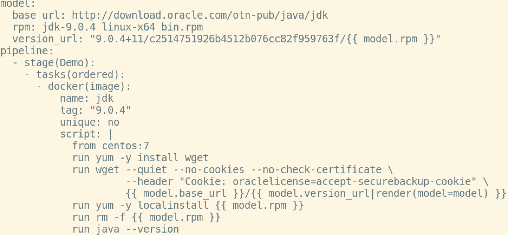

@title[Introduction]
# Spline
### The pipeline tool

**Source** |
http://github.com/Nachtfeuer/pipeline

**Contact** |
[thomas.lehmann.private@gmail.com](mailto:thomas.lehmann.private@gmail.com)

---
@title[Features]
### Features
matrix, pipeline, stages, task groups,
shell, docker(image), docker(container), python,
parallelizable, filterable (tags), model data,
cleanup hook, Jinja2 templating support,
tasks variables, conditional tasks, dynamic report,
dry run support, schema validation.

---
@title[Quickstart]
### Quickstart
#### Installation:

```shell
pip install spline
```

#### Minimal Pipeline:
```yaml
pipeline:
  - stage(Demo):
      - tasks(ordered):
          - shell:
              script: echo "hello world"
```

---
@title[Task Types]
### Task Types

```yaml
- shell:
    script: echo "hello world"
- python:
    script: print("hello world")
- docker(image):
    name: demo
    tag: "1.0"
    unique: no
    script: from centos:7
- docker(container):
    image: demo:1.0
    script: echo "hello world"
```

---
@title[Jinja2 Templating Support (Part One)]
### Jinja2 Templating Support (Part One)
```yaml
model: {"mmsg": "model message"}
pipeline:
  - env: {"pmsg": "pipeline message"}
  - stage(Demo):
      - env: {"smsg": "stage message"}
      - tasks(ordered):
          - env: {"tmsg": "tasks block message"}
          - shell:
              script: |
                echo "User: {{ env.USER }}"
                echo "Model msg: {{ model.mmsg }}"
                echo "Pipeline msg: {{ env.pmsg }}"
                echo "Stage msg: {{ env.smsg }}"
                echo "Tasks block msg: {{ env.tmsg }}"
```
<small>(env. variables are merged, last ones win, OS env. variables come last)</small>

---
@title[Jinja2 Templating Support (Part Two)]
### Jinja2 Templating Support (Part Two)
#### Nested rendering support

```yaml
model:
  one: "{{ env.USER }}: hello"
  two: "{{ model.one|render(env=env) }} world!"
pipeline:
 - stage(This Is A Demo):
   - tasks(ordered):
     - shell:
         script: echo "{{model.two|render(model=model,env=env)}}"
```
(on my machine: `thomas: "hello world!"`)

---
@title[Task Variables]
### Task Variables
#### Special rules:
- either need to be separated via a tasks block or via an **env** block inbetween in same block
- field **variable** not available for docker(image)

#### Example:
```yaml
pipeline:
  - stage(Demo):
    - tasks(ordered):
      - shell:
          script: git rev-parse --short HEAD
          variable: commit
    - tasks(ordered):
      - shell:
          script: "echo \"commit: {{ variables.commit }}\""
```

---
@title[Conditional Tasks]
### Conditional Tasks

 - field **when** available on all task types
 - `when: "'{{ env.BRANCH_NAME }}' == 'master'"`
 - support for **==**, **<**, **<=**, **>** and **>=**
 - support for lists: `when: "'{{ env.BRANCH_NAME }}' in ['prod', 'preprod']"`
 - negate with **not** like `when: "'not {{ env.BRANCH_NAME }}' == 'master'"`;
   for lists: **not in**.
 - single quotes always required for strings

---
@title[Docker Image]
### Task: docker(image)



---
## The End

