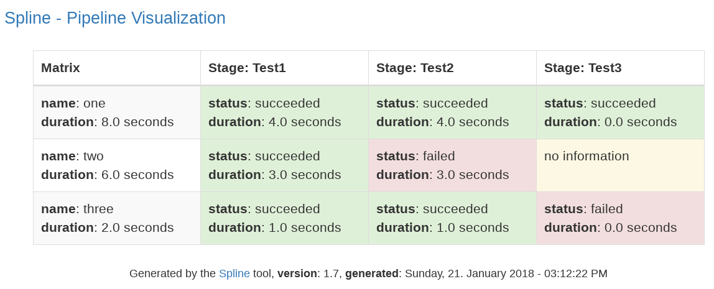

@title[Introduction]
# Spline
### The pipeline tool

**Source** |
http://github.com/Nachtfeuer/pipeline

**Contact** |
[thomas.lehmann.private@gmail.com](mailto:thomas.lehmann.private@gmail.com)

---
@title[Features]
### Features

**Structural** | **Tasks** | **Behaviorial** | **Data**
-------------- | --------- | --------------- | -----------------
Matrix         | Shell     | Ordered         | Model
Pipeline       | Python    | Parallelizable  | Env. Var.
Stages         | Docker    | Filterable      | Task Var.
Tasks Groups   |           | Conditional     | Schema Validation
Tasks          |           | Templating      | Report

**finally** | dry run support, shell debugging, strict mode

---
@title[Quickstart]
### Quickstart
#### Installation:

```shell
pip install spline
```

#### Minimal Pipeline:
```yaml
pipeline:
  - stage(Demo):
      - tasks(ordered):
          - shell:
              script: echo "hello world"
```

**advised use** | virtualenv for flexible upgrading

---
@title[Task Types]
### Task Types

```yaml
- shell:
    script: echo "hello world"

- python:
    script: print("hello world")

- docker(image):
    name: demo
    tag: "1.0"
    unique: no
    script: from centos:7

- docker(container):
    image: demo:1.0
    script: echo "hello world"
```

---
@title[Jinja2 Templating Support (Part One)]
### Jinja2 Templating Support (Part One)
```yaml
model: {"mmsg": "model message"}
pipeline:
  - env: {"pmsg": "pipeline message"}
  - stage(Demo):
      - env: {"smsg": "stage message"}
      - tasks(ordered):
          - env: {"tmsg": "tasks block message"}
          - shell:
              script: |
                echo "User: {{ env.USER }}"
                echo "Model msg: {{ model.mmsg }}"
                echo "Pipeline msg: {{ env.pmsg }}"
                echo "Stage msg: {{ env.smsg }}"
                echo "Tasks block msg: {{ env.tmsg }}"
```
<small>(env. variables are merged, last ones win, OS env. variables come last)</small>

---
@title[Jinja2 Templating Support (Part Two)]
### Jinja2 Templating Support (Part Two)
#### Nested rendering support

```yaml
model:
  one: "{{ env.USER }}: hello"
  two: "{{ model.one|render(env=env) }} world!"
pipeline:
 - stage(This Is A Demo):
   - tasks(ordered):
     - shell:
         script: echo "{{model.two|render(model=model,env=env)}}"
```
(on my machine: `thomas: "hello world!"`)

---
@title[Task Variables]
### Task Variables
#### Special rules:
- either need to be separated via a tasks block or via an **env** block inbetween in same block
- field **variable** not available for docker(image)

#### Example:
```yaml
pipeline:
  - stage(Demo):
    - tasks(ordered):
      - shell:
          script: git rev-parse --short HEAD
          variable: commit
    - tasks(ordered):
      - shell:
          script: "echo \"commit: {{ variables.commit }}\""
```

---
@title[Conditional Tasks]
### Conditional Tasks

 - field **when** available on all task types
 - `when: "'{{ env.BRANCH_NAME }}' == 'master'"`
 - support for **==**, **<**, **<=**, **>** and **>=**
 - support for lists: `when: "'{{ env.BRANCH_NAME }}' in ['prod', 'preprod']"`
 - negate with **not** like `when: "'not {{ env.BRANCH_NAME }}' == 'master'"`;
   for lists: **not in**.
 - single quotes always required for strings

---
@title[Docker Image]
### Task: docker(image)

```
model:
  base_url: http://download.oracle.com/otn-pub/java/jdk
  rpm: jdk-9.0.4_linux-x64_bin.rpm
  version_url: "9.0.4+11/c2514751926b4512b076cc82f959763f/{{ model.rpm }}"
pipeline:
  - stage(Demo):
    - tasks(ordered):
      - docker(image):
          name: jdk
          tag: "9.0.4"
          unique: no
          script: |
            from centos:7
            run yum -y install wget
            run wget --quiet --no-cookies --no-check-certificate \
                     --header "Cookie: oraclelicense=accept-securebackup-cookie" \
                     {{ model.base_url }}/{{ model.version_url|render(model=model) }}
            run yum -y localinstall {{ model.rpm }}
            run rm -f {{ model.rpm }}
            run java --version
```
(script content: Dockerfile syntax, default: image name contains spline pid)

---
@title[Docker Container]
### Task: docker(container)

```yaml
pipeline:
  - stage(Demo):
      - tasks(ordered):
          - docker(container):
              title: Simple Docker container demo
              image: jdk:9.0.4
              mount: yes
              remove: yes
              script: |
                java --version > /mnt/host/java-version.txt
                chown -R $UID:$GID /mnt/host/java-version.txt
```

 - default: docker container automatically removed, no user mount, centos:7
 - using labels **pipeline=$PIPELINE_PID** and **pipeline-stage=$PIPELINE_STAGE**
 - automatic forwarding of ssh agent (see ssh.yaml example)

---
@title[Matrix]
### Matrix

```yaml
matrix:
  - name: one
    env: { "message": "first message" }
  - name: two
    env: { "message": "second message" }

pipeline:
  - stage(Demo):
      - tasks(ordered):
          - shell:
              script: echo "{{ env.message }}"
```
default: run all matrix items, ordered.

```bash
$ spline --definition=matrix-demo.yml 2>&1 |grep "\(message\|matrix\)"
2018-03-04 11:51:03,624 - spline.matrix - Processing pipeline for matrix entry 'one'
2018-03-04 11:51:03,641 - spline.components.tasks -  | first message
2018-03-04 11:51:03,642 - spline.matrix - Processing pipeline for matrix entry 'two'
2018-03-04 11:51:03,665 - spline.components.tasks -  | second message
```

---
@title[Filtering With Tags]
### Filtering With Tags

```yaml
matrix:
  - name: one
    env: { "message": "first message" }
    tags: ['one']
  - name: two
    env: { "message": "second message" }
    tags: ['two']

pipeline:
  - stage(Demo):
      - tasks(ordered):
          - shell:
              script: "first task - {{ env.message }}"
              tags: [ 'one' ]
          - shell:
              script: echo "second task - {{ env.message }}"
              tags: [ 'two' ]
```
 - **--matrix-tags=** | comma separated, for matrix only
 - **--tags=** | comma separated, for tasks only
 - can be combined

---
@title[Parallel Matrix]
### Parallel Matrix

```yaml
matrix(parallel):
  - name: one
    env: { "message": "first message", "sleep": "3" }
  - name: two
    env: { "message": "second message", "sleep": "2" }
  - name: three
    env: { "message": "third message", "sleep": "1" }

pipeline:
  - stage(Demo):
      - tasks(ordered):
          - shell:
              script: |
                sleep {{ env.sleep }}
                echo "{{ env.message }}"
```

Slowest task comes last:

```bash
$ spline --definition=foo 2>&1 | grep message
2018-03-05 18:26:45,544 - spline.components.tasks -  | third message
2018-03-05 18:26:46,541 - spline.components.tasks -  | second message
2018-03-05 18:26:47,536 - spline.components.tasks -  | first message
```
---
@title[Parallel Tasks]
### Parallel Tasks

```
pipeline:
  - stage(Demo):
      - tasks(parallel):
          - shell:
              script: sleep 5; echo "hello word 1"
          - shell:
              script: sleep 3; echo "hello word 2"
          - shell:
              script: sleep 1; echo "hello word 3"
          - env: { "split": "parallel tasks"}
          - shell:
              script: sleep 5; echo "hello word 4"
          - shell:
              script: sleep 3; echo "hello word 5"
          - shell:
              script: sleep 1; echo "hello word 6"
```

- **env** does split parallel "blocks"
- Parallel works just as good as many cpu you have

---
@title[Cleanup Hook]
### Cleanup Hook

```yaml
hooks:
  cleanup:
    script: |
       echo "cleanup called (exit code:$PIPELINE_SHELL_EXIT_CODE)"
pipeline:
  - stage(Demo):
      - tasks(parallel):
          - shell:
              script: echo "all good"
              tags: ['good']
          - shell:
              script: exit 1
              tags: ['bad']
```
 - called on finish of each pipeline when successful
 - called on failed failed task (pipeline stops)

```bash
$ spline --definition=demo.yml --tags=good 2>&1 | grep "cleanup"
2018-03-05 19:05:51,780 - spline.pipeline -  | cleanup called (exit code:0)
$ spline --definition=demo.yml --tags=bad 2>&1 | grep "cleanup"
2018-03-05 19:06:01,797 - spline.components.tasks -  | cleanup called (exit code:1)
```
(for parallel tasks spline waits until completion)

---
@title[Dry Run Mode]
### Dry Run Mode

 - nothing is executed
 - all Bash code visible in the spline log
 - Dockerfile visualized as Bash comment
 - support for problem analysis

---
@title[Report]
### Report



- **--report=html**
- refresh each 5 seconds

---
@title[Ideas, Future Direction]
### Ideas | Future Direction

 * Auto Cleanup Docker Images+Container
 * New task type: Ansible
 * Support for docker-compose
 * Support for Packer
 * Include statement
 * Generator for Jenkinsfile and .travis.yml
 * Spline Server

---
## The End
